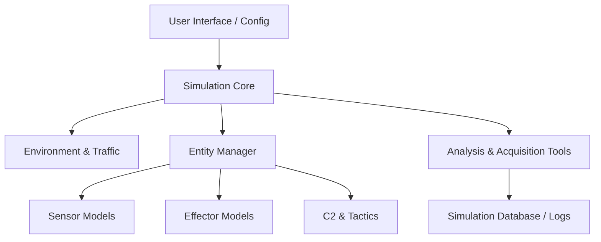

# C-sUAS M&S Software Architecture

This directory contains the detailed software architecture for the Counter-sUAS Modeling and Simulation (M&S) application.

## High-Level Architecture

The application is built on a modular, event-driven architecture to allow for maximum flexibility in modeling different C-sUAS components and operational scenarios.

## Core Components

- **[Simulation Core](file:///Users/kevinkelly/workspace/counterSUAS/03-architecture/software/simulation-engine.md)**: Manages time, events, and the overall simulation lifecycle.
- **[Environment & Traffic](file:///Users/kevinkelly/workspace/counterSUAS/03-architecture/software/environment-model.md)**: Defines the physical world, protected areas, and actor trajectories.
- **[Sensor Models](file:///Users/kevinkelly/workspace/counterSUAS/03-architecture/software/sensor-models.md)**: High-fidelity and stochastic models for Radar, RF, EO/IR, and Acoustic sensors.
- **[Effector Models](file:///Users/kevinkelly/workspace/counterSUAS/03-architecture/software/effector-models.md)**: Models for kinetic and non-kinetic mitigation systems.
- **[C2 & Tactics](file:///Users/kevinkelly/workspace/counterSUAS/03-architecture/software/c2-tactics-architecture.md)**: The "brain" of the C-sUAS system, implementing ROEs and tactical decision-making.
- **[Analysis & Acquisition Tools](file:///Users/kevinkelly/workspace/counterSUAS/03-architecture/software/analysis-acquisition-tools.md)**: Supports trade-off studies, Monte Carlo runs, and sensitivity analysis.
