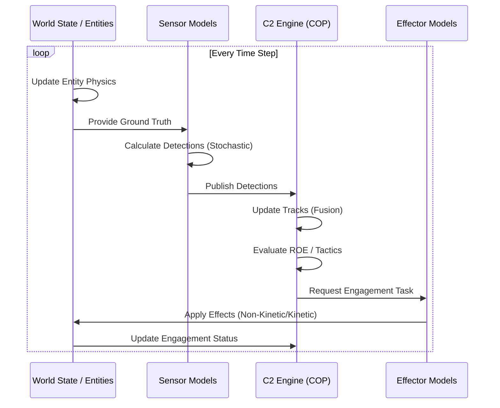

# Data Flow and API Interaction

This document describes how the core components of the Counter-sUAS M&S application interact using the defined APIs.

## 1. Simulation Loop Data Flow

The simulation engine coordinates the exchange of data between the physical world and the logical C2 layers.

## 2. Key Data Contracts

### detection -> Track
Sensors output `Detection` objects containing estimated positions and confidence. The C2 Engine (or a dedicated Fusion model) aggregates these into `Track` objects, which maintain identity and state history.

### Track -> EngagementTask
The C2 Engine analyzes `Track` objects against Rules of Engagement (ROE). If an engagement is authorized, it generates an `EngagementTask` assigned to a specific `BaseEffector`.

### EngagementTask -> Outcome
The Effector processes the task using its stochastic performance model (e.g., `Pd` vs range) and returns an `EngagementStatus` update (SUCCESS, FAILURE, etc.).

## 3. Stochastic Variables
The API supports Monte Carlo analysis by allowing the following to be sampled from distributions:
- **Sensor Error**: `Detection.position_estimate` vs ground truth.
- **Classification Logic**: `Track.classification_confidence`.
- **Effector Probability**: The final `EngagementStatus` outcome.
