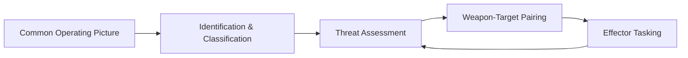

# C2 & Tactics Architecture

This component represents the decision-making logic and operational procedures (tactics) of the C-sUAS system.

## 1. High-Level C2 Logic
The C2 system processes the Common Operating Picture (COP) and implements the engagement cycle:

## 2. Rules of Engagement (ROE) Engine
The ROE engine ensures that engagements comply with policy:
- **Spatial Constraints**: Engagements only allowed in specific zones.
- **Classification Confidence**: Minimum probability of "Hostile" required for kinetic engagement.
- **Collateral Thresholds**: Abort engagement if risk to friendlies/non-threats exceeds limits.

## 3. Tactical Logic
Supports various autonomous and semi-autonomous behaviors:
- **Defense-in-Depth**: Layered defense using long-range EW followed by short-range kinetic.
- **Swarm Defense**: Strategies for allocating resources against massed sUAS threats.
- **Sensor Cross-Cueing**: Automated redirection of high-fidelity sensors (e.g., EO/IR) based on initial detections from wide-area sensors (e.g., Radar).

## 4. Human-In-The-Loop (HITL)
Supports modeling operator latency and decision-making errors:
- **Operator Overload**: Modeling performance degradation when track counts are high.
- **Manual Overrides**: Simulated UI for manual target confirmation and engagement approval.
