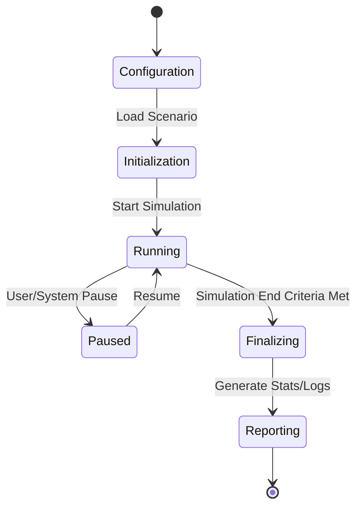

# Simulation Engine Architecture

The Simulation Engine is the backbone of the C-sUAS M&S application, responsible for temporal synchronization and message passing between components.

## 1. Engine Type: Discrete Event vs. Time-Stepped
The engine supports a **hybrid approach**:
- **Discrete Event (DE)**: Used for high-level logic, state changes (e.g., "target detected", "effector launched"), and asynchronous events.
- **Time-Stepped (TS)**: Used for continuous dynamics like flight trajectories, sensor scan patterns, and RF propagation modeling.

## 2. Temporal Control
- **Real-time Factor**: Supports running faster-than-real-time for Monte Carlo analysis or real-time for SIL/HIL testing.
- **Step Size**: Configurable per-component (e.g., 100Hz for flight dynamics, 1Hz for high-level C2).

## 3. Event Bus
A central event bus manages communication between entities:
- **Publish/Subscribe**: Sensors publish "detections"; C2 subscribes to tracks.
- **Deterministic Execution**: Ensures simulation results are repeatable given the same seed.

## 4. Lifecycle Management

