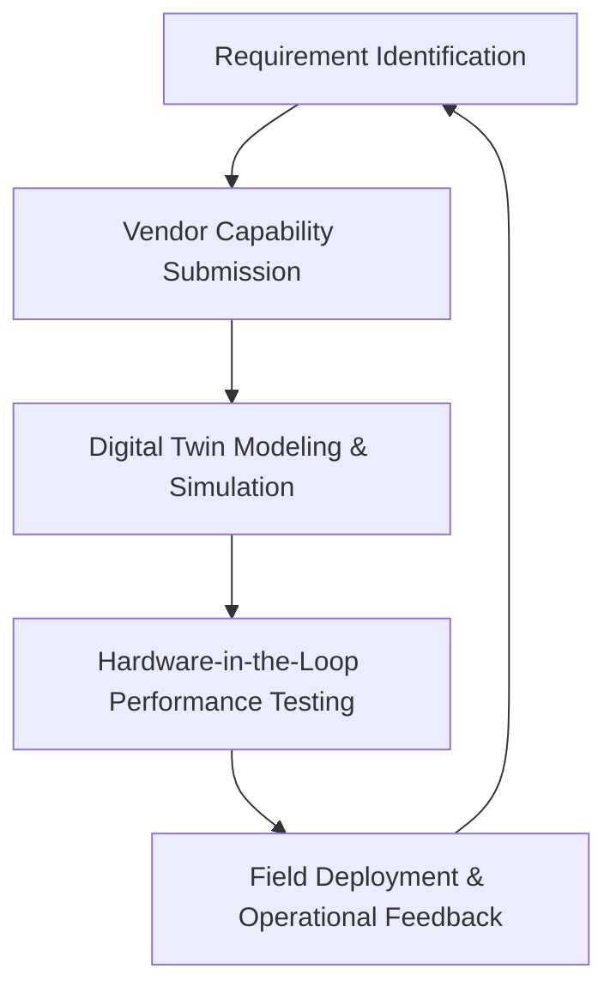

# MOSA Acquisition Strategy: Simulation-Driven & Open-Architecture

This document describes the Counter-sUAS program's approach to acquisition, focusing on active vendor engagement, Modular Open Systems Approach (MOSA) principles, and a modeling-first evaluation lifecycle.

## 1. Active Vendor Engagement
To ensure a robust and innovative ecosystem, the program engages a broad spectrum of vendors (Traditional Defense, Tech Startups, and Component Specialists) through:
- **Plugfests & Industry Days**: Regular events where vendors test their modules against the system's open interfaces.
- **Continuous RFI/RFP Cycles**: Using the [IDIQ Task Order Template](./task-order-template.md) to solicit specific capabilities for evolving threats.
- **Collaborative Research**: Leveraging the `06-innovation` layer to prototype nascent technologies with vendor support.

## 2. Modular Open Systems Approach (MOSA)
The program mandates MOSA to prevent vendor lock-in and enable rapid capability insertion:
- **Standardized Interfaces**: Adoption of standards like SOSA (Sensor Open Systems Architecture) and OMS (Open Mission Systems) for all plug-and-play components.
- **Hardware-Software Decoupling**: Sensors and effectors must expose data via common Pydantic schemas (see `03-architecture/software/api/schemas.py`).
- **Data Rights**: The program prioritizes "Government Purpose Rights" for interface definitions and core orchestration logic.

## 3. Deployment Lifecycle: Design, Evaluate, Deploy

### Phase A: Design & Modeling
Vendors provide digital models (JSON/Python) of their components. These are integrated into the [Simulation Engine](../03-architecture/software/simulation-engine.md) to assess performance in scenarios like the [LAX Protection Scenario](../03-architecture/software/scenarios/lax-protection-scenario.json).

### Phase B: Evaluation & Testing
- **Digital Fly-Offs**: Multiple vendor models are run in parallel simulations to compare Pd (Probability of Detection) and Pk (Probability of Kill) metrics.
- **T&E Integration**: Results are stored in the [te-results repository](../04-analysis/te-results/) for objective tradeoff studies.

### Phase C: Deployment
Components that meet performance goals in T&E are selected for task orders and deployed. Operational telemetry is fed back into the `04-analysis` layer to refine requirements for the next cycle.

## 4. Ensuring Performance Goals
By using the **Digital Twin** approach, the program ensures that:
1. **Design Goals** are met before expensive physical prototypes are built.
2. **Requirements** are validated against realistic traffic profiles and environment configurations.
3. **Interoperability** is verified at the software layer before hardware integration.
